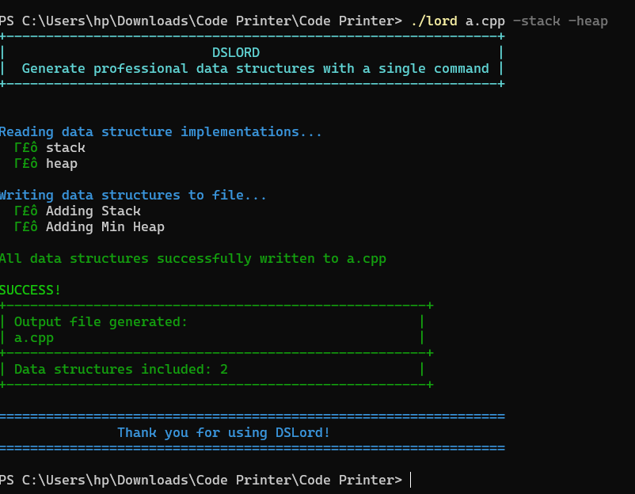
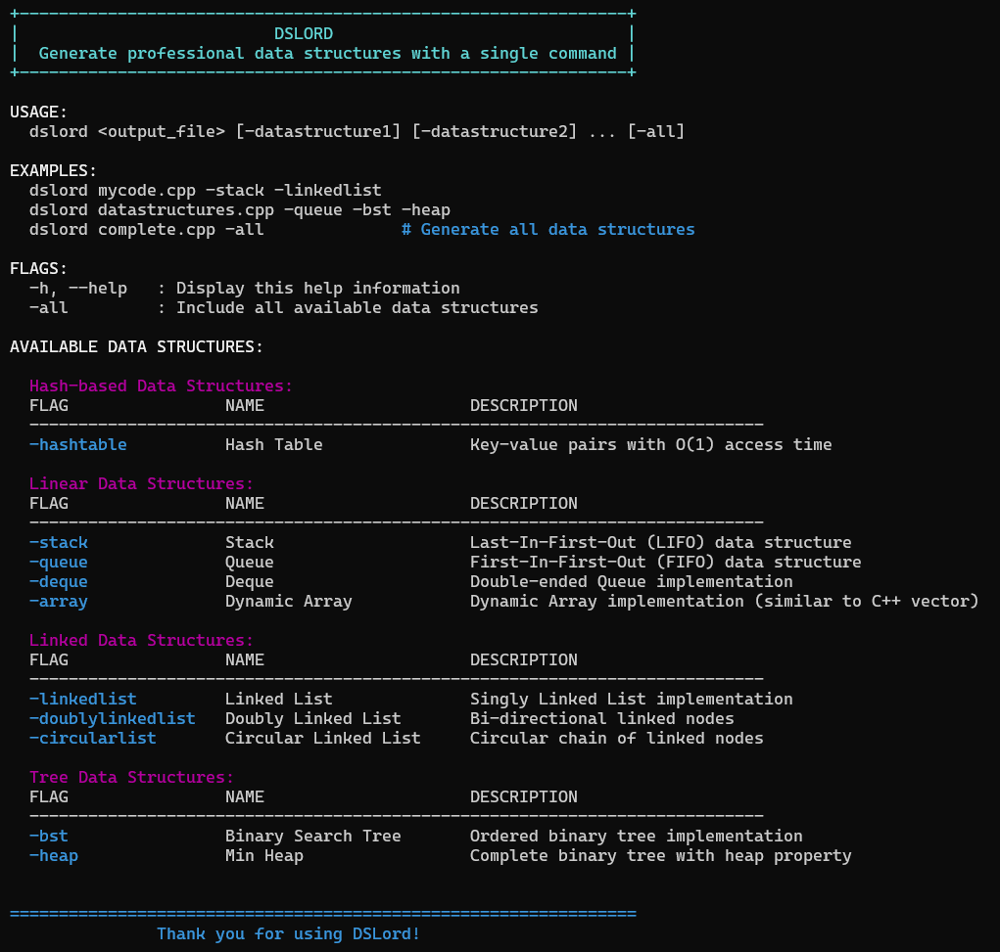

# DSLord

 

A professional command-line utility for generating high-quality data structure implementations with a single command.

<div align="center">
  
</div>

## 📋 Table of Contents
- [Overview](#overview)
- [Features](#features)
- [Available Data Structures](#available-data-structures)
- [Installation](#installation)
- [Usage](#usage)
- [Project Structure](#project-structure)
- [Implementation Details](#implementation-details)
- [How It Works](#how-it-works)
- [Contributing](#contributing)
- [License](#license)
- [Help](#help)
- [Acknowledgments](#acknowledgments)

## 🔍 Overview

DSLord is a powerful tool designed for computer science students and professionals who need quick access to well-implemented, error-free data structure implementations. With a simple command, you can generate production-ready code for various data structures.

## ✨ Features

- **Multiple Data Structures**: Generate 10+ different data structures
- **Clean Code**: Well-documented, properly designed implementations
- **Error-Free**: Tested and guaranteed to compile
- **Customizable**: Select only the data structures you need
- **Example Usage**: Includes sample code demonstrating how to use each data structure
- **Categorized Organization**: Data structures organized by type (Linear, Linked, Tree, etc.)

## 📊 Available Data Structures

### Linear Data Structures
- Stack (LIFO)
- Queue (FIFO)
- Deque (Double-ended Queue)
- Dynamic Array (Similar to std::vector)

### Linked Data Structures
- Singly Linked List
- Doubly Linked List
- Circular Linked List

### Tree Data Structures
- Binary Search Tree (BST)
- Min Heap

### Hash-based Data Structures
- Hash Table (with separate chaining)

## 💻 Installation

### Prerequisites
- C++ compiler (GCC, Clang, MSVC, etc.)
- Basic command-line knowledge

### Steps

1. Clone this repository:
   ```
   git clone https://github.com/yourusername/dslord.git
   ```

2. Compile the DSLord utility:
   ```
   cd dslord
   g++ -o dslord dslord.cpp
   ```

3. Run DSLord:
   ```
   ./dslord output_file.cpp -stack -queue
   ```

## 🚀 Usage

```
dslord <output_file> [-datastructure1] [-datastructure2] ... [-all]
```

<div align="center">
  
</div>

### Examples

Generate a file with Stack and Queue implementations:
```
dslord mycode.cpp -stack -queue
```

Generate a file with Linked List and Binary Search Tree:
```
dslord datastructures.cpp -linkedlist -bst
```

Generate a file with all available data structures:
```
dslord complete.cpp -all
```

### Available Flags

| Flag | Data Structure |
|------|----------------|
| -stack | Stack (LIFO) |
| -queue | Queue (FIFO) |
| -deque | Double-ended Queue |
| -array | Dynamic Array |
| -linkedlist | Singly Linked List |
| -doublylinkedlist | Doubly Linked List |
| -circularlist | Circular Linked List |
| -bst | Binary Search Tree |
| -heap | Min Heap |
| -hashtable | Hash Table |
| -all | All data structures |
| -h, --help | Display help information |

## 📁 Project Structure

```
dslord/
├── dslord.cpp       # Main source code
├── dslord.exe       # Compiled program (Windows)
├── data/                 # Images and documentation
│   ├── demo.png          # Demo screenshot
│   └── help.png          # Help screen screenshot
├── snippets/             # Data structure implementations
│   ├── array.cpp         # Dynamic Array implementation
│   ├── bst.cpp           # Binary Search Tree implementation
│   ├── circularlist.cpp  # Circular Linked List implementation
│   ├── deque.cpp         # Double-ended Queue implementation
│   ├── doublylinkedlist.cpp # Doubly Linked List implementation
│   ├── hashtable.cpp     # Hash Table implementation
│   ├── heap.cpp          # Min Heap implementation
│   ├── linkedlist.cpp    # Singly Linked List implementation
│   ├── queue.cpp         # Queue implementation
│   └── stack.cpp         # Stack implementation
└── README.md             # Documentation
```

## 🔧 Implementation Details

Each data structure is implemented with the following features:

- **Comprehensive Documentation**: Every function and class is well-documented
- **Error Handling**: Proper exception handling for edge cases
- **Memory Management**: Efficient use of memory with proper cleanup
- **Debug Utilities**: Display functions for easy debugging
- **Standard C++ Compliance**: No external dependencies

## ⚙️ How It Works

1. The user specifies which data structures they want via command-line flags
2. DSLord reads the corresponding snippets from the snippets/ directory
3. The program combines all snippets into a single file, removing redundant includes
4. The main function is generated with example usage of all selected data structures
5. The final file is written to the specified output path

## 👥 Contributing

Contributions are welcome! If you'd like to add more data structures or improve existing ones:

1. Fork the repository
2. Create a new branch for your feature
3. Add your implementation to the snippets/ directory
4. Update the main program to include your new data structure
5. Submit a pull request

## 📄 License

This project is licensed under the MIT License - see the LICENSE file for details.

## ❓ Help

If you need help using DSLord, you can run:

```
dslord -h
```

This will display the help information with all available commands and options.

## 🙏 Acknowledgments

- Developed as an educational tool for computer science students
- Inspired by the need for quick access to reliable data structure implementations

---

Created with ❤️ by DSLord Team 